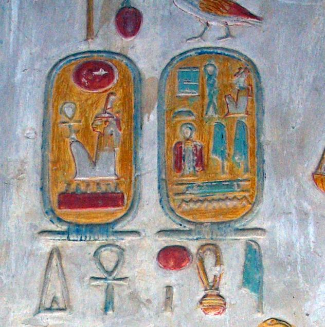

# Cartouche Decoder

Cartouche Decoder is a mobile application allowing to decode Pharaon's name written
in Ancient Egypt cartouches. A cartouche is defined as following on [Wikipedia]:

> In Egyptian hieroglyphs, a cartouche is an oval with a horizontal line at one end, indicating that the text enclosed is a royal name.

For instance, here is the cartouche for Pharaon Séthy 1st:

## Installation

This project has been run using the following:
s
* [Android Studio 2.1](https://developer.android.com/studio/index.html)
* [Java SE Development Kit 8](http://www.oracle.com/technetwork/java/javase/downloads/jdk8-downloads-2133151.html)
